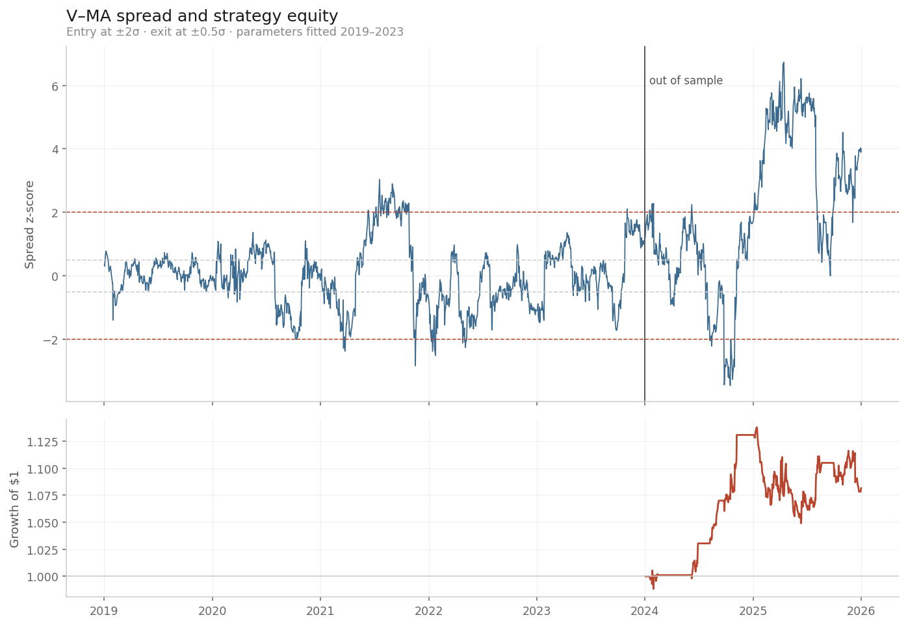

# Pairs Trading / Statistical Arbitrage Backtester

Cointegration-based mean-reversion strategy on a single equity pair, tested out of sample with transaction costs.

**Headline result: the strategy does not survive realistic trading costs.** Gross Sharpe 0.02; at 5 bps per trade the Sharpe is negative. The cointegration relationship that justified the trade broke down in the test period.

## Method

1. **Candidate selection on economic logic, not screening.** Five same-industry pairs: KO–PEP, XOM–CVX, V–MA, HD–LOW, GS–MS. Screening a large universe for correlation produces spurious pairs; pairs trading requires a structural reason two assets should track each other.
2. **Engle–Granger cointegration test** on 2019–2023 data only. Cointegration — a stable, mean-reverting spread — is the requirement, not correlation, since correlated series can diverge permanently.
3. **Hedge ratio by OLS** of one leg on the other, so the position is a bet on the spread rather than on market direction.
4. **Signal:** z-score of the spread, standardised using training-period mean and standard deviation only. Entry at ±2σ, exit at ±0.5σ.
5. **Positions lagged one day** (`.shift(1)`) to eliminate lookahead bias.
6. **Out-of-sample backtest** on 2024–2025, with transaction costs applied at 0, 5 and 10 bps.

## Pair selection

| Pair | p-value | |
|---|---|---|
| V–MA | 0.0078 | cointegrated |
| GS–MS | 0.0419 | marginal |
| KO–PEP | 0.0711 | not cointegrated |
| HD–LOW | 0.0903 | not cointegrated |
| XOM–CVX | 0.1762 | not cointegrated |

Only **V–MA** was traded. GS–MS clears the 5% threshold only narrowly, and testing five pairs at that level yields approximately one false positive by chance — the multiple testing problem. V–MA has both the strongest statistic and the tightest economic case: two card networks with near-identical revenue models, regulation and transaction volumes.

Fitted hedge ratio: **0.528** shares of MA short per share of V long, reflecting MA's higher price and neutralising net market exposure.

## Results (2024–2025, out of sample)

| Cost | Total return | Annualised | Sharpe |
|---|---|---|---|
| 0 bps | 8.2% | 4.2% | 0.02 |
| 5 bps | 7.6% | 3.9% | −0.02 |
| 10 bps | 7.0% | 3.6% | −0.06 |

Volatility 6.6% · max drawdown −7.8% · win rate 48.9% · 12 trades over 502 days

Costs are charged once per position change; in practice both legs trade, so realised costs would be roughly double those modelled.

## Why it failed

- **The cointegration relationship broke.** In 2019–2023 the spread oscillated around its mean and reverted from every ±2σ excursion. After 2023 it rose to **+6.7σ and remained there for most of 2025**, never returning to the exit band. The test was correct about the training period and uninformative about what followed.
- **The position became a trap rather than a trade.** The flat section of the equity curve through early 2025 is a short spread position held for months awaiting a reversion that did not occur.
- **No directional edge.** A 48.9% win rate is indistinguishable from chance.
- **The gross edge was smaller than the cost of trading.** A 4.2% annualised return against a 4% risk-free rate leaves nothing to pay the spread and commission from.

The hedging did work: 6.6% volatility confirms the position was a bet on the spread and not on the market.

## Limitations

- One pair, one test window. Twelve trades is a thin sample on which to conclude anything.
- Static hedge ratio and static thresholds, fitted once and held.
- No borrow costs or short-availability constraints modelled.
- Daily closing prices only; intraday execution is not represented.

## Possible extensions

Rolling re-estimation of the hedge ratio and z-score parameters; a Kalman filter for a time-varying hedge ratio; a stop-loss to cap losses when the spread fails to revert; portfolio-level testing across multiple pairs; a structural-break test to detect relationship breakdown in real time.

## Running it

Open `pairs_trading.ipynb` in Google Colab and run the cells in order. Requires `yfinance`, `pandas`, `numpy`, `statsmodels`, `matplotlib`.
